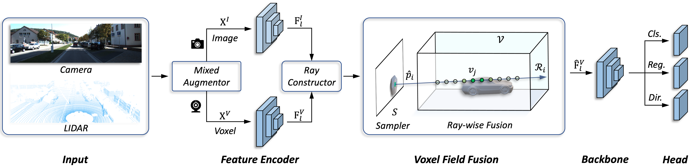

# VFF
**Voxel Field Fusion for 3D Object Detection**

Yanwei Li, Xiaojuan Qi, Yukang Chen, Liwei Wang, Zeming Li, Jian Sun, Jiaya Jia

[[`arXiv`](https://arxiv.org/pdf/2205.15938.pdf)] [[`BibTeX`](#CitingVFF)]

<div align="center">
  
</div><br/>

This project provides an implementation for the CVPR 2022 paper "[Voxel Field Fusion for 3D Object Detection](https://arxiv.org/pdf/2205.15938.pdf)" based on [OpenPCDet](https://github.com/open-mmlab/OpenPCDet). VFF aims to maintain cross-modality consistency by representing and Image fusing augmented image features as a ray in the voxel field.

## Installation
This project is based on [OpenPCDet](https://github.com/open-mmlab/OpenPCDet), which can be constructed as follows.
* Install OpenPCDet following [the instructions](./docs/INSTALL.md).
* Prepare the dataset following [the structure](./docs/GETTING_STARTED.md).

## Training
You can train the model following [the instructions](./docs/GETTING_STARTED.md).
You can find the pretrained DeepLab V3 [here](https://download.pytorch.org/models/deeplabv3_resnet50_coco-cd0a2569.pth) if you want to train the model from scratch.
For example, to launch PVRCNN-VFF training on multi GPUs,
one should execute:
```bash
cd /path/to/vff/tools
bash scripts/dist_train.sh ${NUM_GPUS} --cfg_file cfgs/kitti_models/VFF_PVRCNN.yaml
```
or train with a single GPU:
```bash
python3 train.py --cfg_file cfgs/kitti_models/VFF_PVRCNN.yaml
```

## Evaluation
You can evaluate the model following [the instructions](./docs/GETTING_STARTED.md).
For example, to launch PVRCNN-VFF evaluation with a pretrained checkpoint on multi GPUs,
one should execute:
```bash
bash scripts/dist_test.sh ${NUM_GPUS} \
    --cfg_file cfgs/kitti_models/VFF_PVRCNN.yaml --batch_size ${BATCH_SIZE} --ckpt ${CKPT}
```
or evaluate with a single GPU:
```bash
python3 test.py --cfg_file cfgs/kitti_models/VFF_PVRCNN.yaml --batch_size ${BATCH_SIZE} --ckpt ${CKPT}
```
## KITTI 3D Object Detection Results
We provide results on KITTI *val* set with pretrained models. All models are trained and evaluated on 8 V100 GPU.
|                                             | Car@R40 | Pedestrian@R40 | Cyclist@R40  | download | 
|---------------------------------------------|:-------:|:-------:|:-------:|:---------:|
| [PVRCNN-VFF](tools/cfgs/kitti_models/VFF_PVRCNN.yaml) | 85.50 | 65.30 | 73.30 | [GoogleDrive](https://drive.google.com/file/d/1FaoiHsOoeXhr_l37uoHiW9VLwB_FAy2F/view?usp=sharing) | 
| [VoxelRCNN-VFF](tools/cfgs/kitti_models/VFF_VoxelRCNN.yaml) | 85.72 | - | - | [GoogleDrive](https://drive.google.com/file/d/1ggITEcX-tFM-gHEa0DSP_J9oT-eHH647/view?usp=sharing) |

## Acknowledgement
We would like to thank the authors of [OpenPCDet](https://github.com/open-mmlab/OpenPCDet) and [CaDDN](https://github.com/TRAILab/CaDDN) for their open-source release.

## License
`VFF` is released under the [Apache 2.0 license](LICENSE).

## <a name="CitingVFF"></a>Citing VFF

Consider cite VFF in your publications if it helps your research.

```
@inproceedings{li2022vff,
  title={Voxel Field Fusion for 3D Object Detection},
  author={Li, Yanwei and Qi, Xiaojuan and Chen, Yukang and Wang, Liwei and Li, Zeming and Sun, Jian and Jia, Jiaya},
  booktitle={IEEE Conference on Computer Vision and Pattern Recognition (CVPR)},
  year={2022}
}
```
